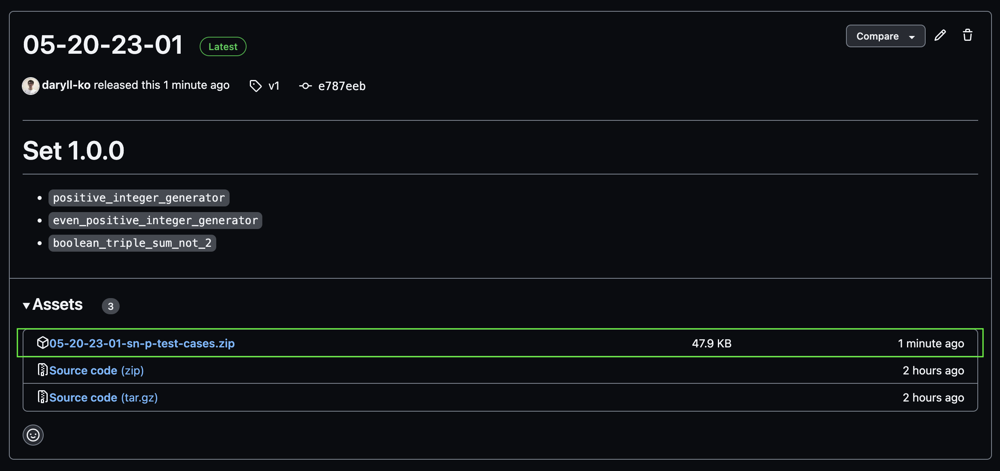

# `sn-p-test-cases`

Hello! This repo holds all test cases for evaluating Spiking Neural P (SN P) system simulations.

## Downloading test cases

You can download all existing test cases by visiting the `Releases` section and downloading the `{release}-sn-p-test-cases.zip` archive attached to the latest release.

## Test case format

Each format folder (`xml`, `json`, `yaml`) contains several systems and simulation snapshots for those systems. For each system, there's a file named $`\verb!name!`$ or $`\verb!name(inputs)!`$ for the system itself and a folder with the same name for the system's snapshots. The snapshot folder contains files named $`\verb!name[timestamp]!`$ or $`\verb!name(inputs)[timestamp]!`$.

## Test case list

| Name                                 | Function                                                                                                                                                                                                            | Source                                                                          | Notes                                                     |
| ------------------------------------ | ------------------------------------------------------------------------------------------------------------------------------------------------------------------------------------------------------------------- | ------------------------------------------------------------------------------- | --------------------------------------------------------- |
| `positive_integer_generator`         | generates $`\{k \mid k \ge 2\}`$ using nondeterminism                                                                                                                                                               | [Leporati et al.](https://link.springer.com/article/10.1007/s11047-022-09917-y) | probability of generating $`k`$ is $`\dfrac{1}{2^{k-1}}`$ |
| `even_positive_integer_generator`    | generates $`\{2k\mid k \ge 1\}`$ using nondeterminism                                                                                                                                                               | [Păun](https://cs.ioc.ee/yik/schools/win2007/paun/snppalmse.pdf)                | probability of generating $`2k`$ is $`\dfrac{1}{2^{k}}`$  |
| `boolean_triple_sum_not_2(b1,b2,b3)` | if $`in_{i}`$ is constantly provided with bit $`\verb!bi!`$, there is an output spike at $`t = 3`$ iff $`\verb!b1! + \verb!b2! + \verb!b3! \ne 2`$                                                                  | [Păun](https://cs.ioc.ee/yik/schools/win2007/paun/snppalmse.pdf)                |                                                           |
| `increment(v)`                       | increment the number $`\verb!v!`$ in the register neuron $`r`$ by $`1`$ (a neuron containing $`2k`$ spikes represents number $`k`$); module passes control to one of $`l_{j}`$ and $`l_{k}`$ at random              | [Leporati et al.](https://link.springer.com/article/10.1007/s11047-022-09917-y) |                                                           |
| `decrement(v)`                       | decrement the number $`\verb!v!`$ in the register neuron $`r`$ by $`1`$ (a neuron containing $`2k`$ spikes represents number $`k`$); module passes control to $`l_{j}`$ if $`\verb!v! > 0`$ and $`l_{k}`$ otherwise | [Leporati et al.](https://link.springer.com/article/10.1007/s11047-022-09917-y) |                                                           |
