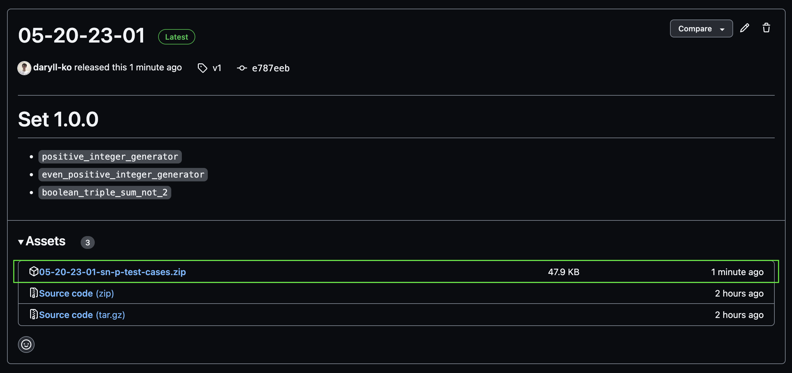

# `sn-p-test-cases`

Hello! This repo holds all test cases for evaluating Spiking Neural P (SN P) system simulations.

## Downloading test cases

You can download all existing test cases by clicking the green `<> Code` button and downloading the repo as a ZIP archive:

## Test case list

| Name                              | Type       | Function                                                                                                                           | Source                                                                          |
| --------------------------------- | ---------- | ---------------------------------------------------------------------------------------------------------------------------------- | ------------------------------------------------------------------------------- |
| `positive_integer_generator`      | generating | generates $`\{k \mid k \ge 2\}`$ using nondeterminism                                                                              | [Leporati et al.](https://link.springer.com/article/10.1007/s11047-022-09917-y) |
| `even_positive_integer_generator` | generating | generates $`\{2k\mid k \ge 1\}`$ using nondeterminism                                                                              | [Păun](https://cs.ioc.ee/yik/schools/win2007/paun/snppalmse.pdf)                |
| `boolean_triple_sum_not_2`        |            | if $`in_{i}`$ is constantly provided with bit $`b_{i}`$, there is an output spike at $`t = 3`$ iff $`b_{1} + b_{2} + b_{3} \ne 2`$ | [Păun](https://cs.ioc.ee/yik/schools/win2007/paun/snppalmse.pdf)                |
